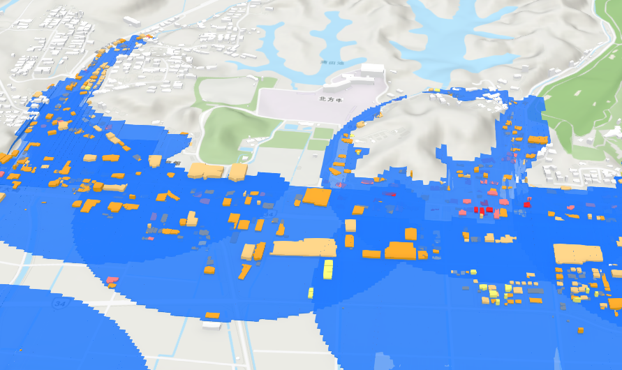

# FY2023 Project PLATEAU UC-03 「損害保険支払い作業の迅速化等」の成果物
### DamageAmountSimulation


## 1.概要
3D都市モデルの地形モデルを活用した災害シミュレーションを基礎として、建築物モデルが持つ詳細情報と損害保険会社等が有する想定被害額算出ノウハウを組み合わせた事前の被害額シミュレーション及びこれに基づく保険金支払いを支援するシステムの開発と、その被害認定が適切に行えるかを評価するためのプロジェクトです。


## 2. 「損害額シミュレータ」について

### ユースケース概要
令和4年度の3D 都市モデルを活用した社会的課題解決型ユースケース開発業務「損害保険支払い作業の迅速化等」では、3D都市モデルや属性情報を利用して、水害や土砂災害を簡易シミュレーションを行い、建物の被害率や損害額などの算出を行うシステムを開発しました。

### システム概要
- 水害時の情報または過去の水害の実績より、特定地点の浸水深が得れている場合に、その地点の「緯度・経度・浸水深」を入力することにより、被害エリアのシミュレーションを行い、損害額などを算出することが可能です。
- 土砂災害の場合も水害と同様に、その地点の「緯度・経度・堆積深・堆積角」を入力することにより、被害エリアのシミュレーションを行い、損害額などを算出することが可能です。
- 国土数値情報で公開されている「洪水浸水想定区域データ」をインプットとして、その指定した河川が氾濫した場合に発生する被害額などを算出することが可能です。
- 本システムでは、ArcGIS Proの有料ライセンスが必要となります。動作環境に記載したツールや、ArcGISのオプションライセンスも必要となるケースがございます。
- 建物の評価額や損害額を算出するためには設定ファイルの変更が必要である。現在はダミーでの値が入っているため、手順書に従い事前変更が必須となります。
- 本システムの詳細については[技術検証レポート](https://XXXXX)を参照してください。


## 3. 利用手順
 本システムの構築手順及び、利用手順、データ準備手順は[利用チュートリアル](https://XXXXX)をご確認ください。


## 4. 動作環境
損害額シミュレータを実行するには、以下の環境が必要です。

| 項目 | 最小動作環境 | 推奨動作環境 | 
| - | - | - | 
| OS | Microsoft Windows 10 または 11 | 同左 | 
| CPU | 2コア、同時マルチスレッディング |  4コア(推奨)、10コア(最適) | 
| メモリ | 8GB以上 | 32GB(推奨)、64GB(最適) | 
| GPU |- | 4GB | 
| ディスプレイ解像度 | 1024×768以上 |  1080p以上  | 
| ストレージ | 32GB以上の空き容量 |  32 GB 以上の空き容量 (ソリッド ステート ドライブ (SSD) 上) | 
| ツール | ArcGIS Pro 3.1（Basic以上のライセンス） | 同左 | 

※ツールオプション：ArcGIS 3D Analyst<br>
3D都市モデルをファイルジオデータベース（FGDB）形式に変換する場合に必要となります。一部の市においては、FGDB形式でデータが配布されているので、それを利用する場合は本オプションは不要となります。


入力データ：
- 洪水浸水想定区域データ（第4.0版）(https://nlftp.mlit.go.jp/ksj/gml/datalist/KsjTmplt-A31a-v4_0.html)
- 3D都市モデルオープンデータ（v2.3.0）(https://www.mlit.go.jp/plateau/open-data/)


## 5. 本リポジトリのフォルダ構成

都市構造シミュレータのフォルダー構成のうち、設定ファイルの置き場などユーザが利用するフォルダのみ記載し、システムのみが利用するフォルダについては記載を省略する。

```markdown
└─plateau
    ├─data
    │  ├─contact：契約フラグを付けるためのデータの格納場所
    │  ├─hazard_data：FGDB形式にした洪水浸水想定区域データの格納場所
    │  ├─plateau_data：FGDB形式にした3D都市モデルの格納場所
    │  └─不動産ID：不動産IDと3D都市モデルの建物IDを紐づけたCSVデータの格納場所
    ├─tools
    │  └─tables
    │      ├─評価額_建物単価.csv
    │      ├─浸水損傷率_建物.csv
    │      └─土砂損傷率_建物.csv
    └─plateau_hazard_simulation.aprx

```

- **data**　フォルダー<br>
利用手順書の「データの事前準備編」で作成した、プログラムを動かすために必要なデータを格納するためのフォルダ。

- **tools/tables**　フォルダー<br>
建物の用途・構造種別などに応じた評価額の設定テーブルや、浸水深／堆積深に応じた建物の損傷率の設定テーブルを格納するためのフォルダ。

- **plateau_hazard_simulation.aprx**<br>
プログラム起動させるための実行ファイル。


## 6. ライセンス
- ソースコードおよび関連ドキュメントの著作権は国土交通省に帰属します。
- 本ドキュメントは[Project PLATEAUのサイトポリシー](https://www.mlit.go.jp/plateau/site-policy/)（CCBY4.0および政府標準利用規約2.0）に従い提供されています。


## 7. 注意事項
- 本リポジトリのプログラムは、動作環境で指定した環境以外での動作保証を行っておりません。
- 予告なく変更・削除する可能性があります。
- 本リポジトリの利用により生じた損失及び損害等について、国土交通省はいかなる責任も負わないものとします。


## 8. 参考資料
- 技術検証レポート: <https://XXXXX>
- PLATEAU Webサイト Use caseページ「損害額シミュレータ」: <https://XXXXX>
