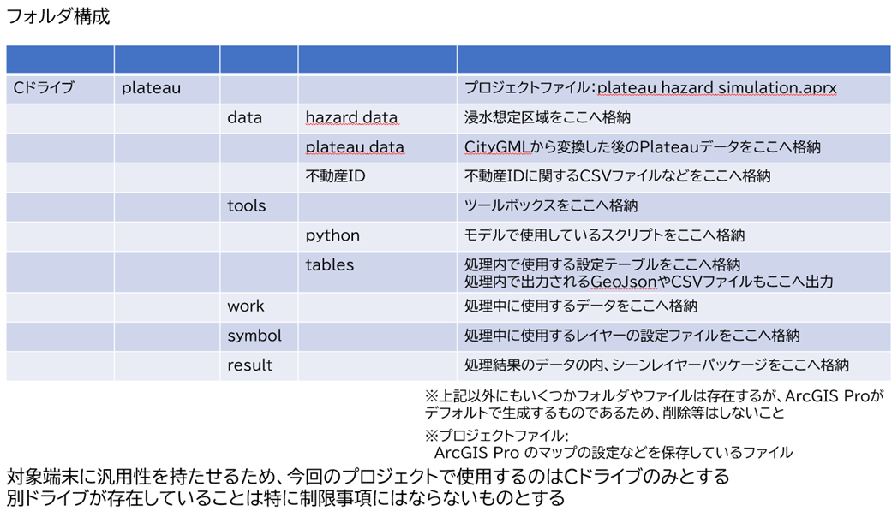
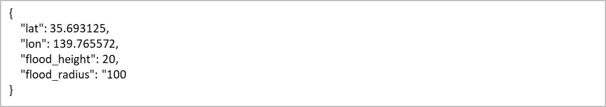

# 環境構築手順書

# 1. 本書について

本書では、損害額シミュレータ（以下「本システム」という。）の利用環境構築手順について記載しています。本システムの構成や仕様の詳細については[技術検証レポート](https://XXXXX)も参考にしてください。

# 2. 動作環境

本システムの動作環境は以下のとおりです。

| 項目 | 最小動作環境 | 推奨動作環境 | 
| - | - | - | 
| OS | Microsoft Windows 10 または 11 | 同左 | 
| CPU | 2コア、同時マルチスレッディング |  4コア(推奨)、10コア(最適) | 
| メモリ | 8GB以上 | 32GB(推奨)、64GB(最適) | 
| GPU | - | 4GB | 
| ディスプレイ解像度 | 1024×768以上 |  1080p以上  | 
| ストレージ | 32GB以上の空き容量 |  32 GB 以上の空き容量 (ソリッド ステート ドライブ (SSD) 上) | 
| ソフトウェア | ArcGIS Pro 3.1（Basic以上のライセンス） | 同左 | 
| ソフトウェアオプション | - | ArcGIS 3D Analyst※ | 

※ArcGIS 3D Analystとは、ArcGIS Proのエクステンション（有料のツールオプション）のことです。
3D都市モデルをファイルジオデータベース（FGDB）形式に変換する場合に必要となります。一部の市においては、FGDB形式でデータが配布されているので、それを利用する場合は本オプションは不要となります。

# 3. ArcGISのインストール手順

- [My Esri](https://www.esri.com/ja-jp/my-esri-login)からArcGIS Pro(バージョン 3.1）をダウンロードし、インストールを行います。
※ArcGIS Proをダウンロードするには有料ライセンスが必要なため、ESRIジャパン（株）からライセンスを購入ください。

- 続いて、[My Esri](https://www.esri.com/ja-jp/my-esri-login)から「ArcGIS Coordinate Systems Data」もダウンロードし、インストールを行います。インストール手順に不明点があれば[こちら](https://pro.arcgis.com/ja/pro-app/latest/help/mapping/properties/arcgis-coordinate-systems-data.htm)も参照ください。

# 4. 本システムのダウンロード

ソースファイルをダウンロードし、適切なフォルダに配置するだけでプログラムが実行可能です。
ソースファイルは[こちら](https://XXXXX)からダウンロード可能です。

GitHubからダウンロードし、解答したソースファイルは「Cドライブ直下」に配置ください。
Cドライブ以外のドライブに配置してもプログラムは動きませんので、ご注意ください。
構成は以下のようになります。

# 5. APIの作成
続いて浸水APIや土砂APIを利用する場合はAPIの作成が必要となります。
APIのIF仕様書は5-1と5-2を参照ください。
接続するAPI(URL)が明確になりましたら、以下ファイルの接続先URLを変更ください。
- フォルダパス 
    C:\plateau\tools\python
- 対象ファイル 
    浸水シミュレーションAPI：get_geojson_flood.py 
    土砂シミュレーションAPI：get_geojson_landslide.py
- 方法 
    対象ファイル内の変数[url] に設定しているURLを、自身が作成したURLに変更

## 5-1. 浸水APIのIF仕様書

### リクエスト
- 概要：浸水エリア生成リクエスト
- アクセスURL：https://[サーバごとに設定]/make_flood_prediction
- メソッド：POST
- 形式：Json
- 文字コード：UTF-8
- 引数

| No. | 変数         | 出現条件 | 出現回数 | 必須 | 値（型） | 例         | 内容         | 備考                                       |
| --- | ------------ | -------- | -------- | ---- | -------- | ---------- | ------------ | ------------------------------------------ |
| 1   | lat          | 　       | 1        | ○   | 実数     | 35.693125  | 中心緯度     |                                            |
| 2   | lon          | 　       | 1        | ○   | 実数     | 139.765572 | 中心軽度     |                                            |
| 3   | flood_height | 　       | 1        | ○   | 整数     | 20         | 浸水高さ(cm) | 浸水面の地表面からの高さ（cm）             |
| 4   | flood_radius | 　       | 1        | ○   | 整数     | 100        | 計算範囲(m)  | 計算を実施する半径（m）　※～600ｍまで対応 |

浸水エリア生成リクエストのJson例

### レスポンス
- 概要：浸水レポート作成レスポンス
- 形式：GeoJson
- レスポンス

| No. | 変数                            | 出現条件 | 出現回数 | 値（型） | 例  | 内容             | 備考   |
|-----|---------------------------------|----------|----------|----------|-----|------------------|--------|
| 1   | Feature/properties/FloodSurface | 　       | 1        | 整数     | 560 | 浸水面高さ（cm） | TP標高 |

浸水レポート作成レスポンスのJson例

### レスポンスコード
- 概要：レポート作成レスポンスコード一覧（基本ベースはHTTPステータスコード準拠、特記部分のみ記載）
- 形式：Json

| No. | レスポンスコード           | 要因                                                                                                                                              |
|-----|----------------------------|---------------------------------------------------------------------------------------------------------------------------------------------------|
| 1   | 201 Created                | リクエストが受理され、Geojsonが作られた場合                                                                                                       |
| 2   | 204 No Content             | リクエストは受理されたが、Geojsonが生成されない場合      ・対象エリア範囲外（DEMデータ整備範囲外）      ・入力された浸水高で浸水が広がらない など |
| 3   | 400 Bad Request            | リクエストで受理できない場合      ・指定された計算範囲(m)が範囲外 など                                                                            |
| 4   | 403 Forbidden              | 認証しているIPアドレス以外からリクエストを受信した場合                                                                                            |
| 5   | 405 Method Not   Allowed   | リクエスト受信がPOSTではない場合                                                                                                                  |
| 6   | 422 Unprocessable   Entity | リクエスト受信したJSON形式のフォーマット異常の場合                                                                                                |
| 7   | 500 Internal Server Error  | リクエストは受理したが、Geojsonが生成時にエラーが発生した場合                                                                                     |

## 5-2. 土砂APIのIF仕様書

### リクエスト
- 概要：土砂エリア生成リクエスト
- アクセスURL：https://[サーバごとに設定]/make_landslide_prediction
- メソッド：POST
- 形式：Json
- 文字コード：UTF-8
- 引数

| No. | 変数             | 出現条件 | 出現回数 | 必須  | 値（型） | 例         | 内容         | 備考                                      |
|-----|------------------|----------|----------|-------|----------|------------|--------------|-------------------------------------------|
| 1   | lat              | 　       | 1        | ○    | 実数     | 35.693125  | 中心緯度     | 　                                        |
| 2   | lon              | 　       | 1        | ○    | 実数     | 139.765572 | 中心軽度     | 　                                        |
| 3   | landslide_height | 　       | 1        | ○    | 整数     | 300        | 堆積高さ(cm) | 堆積物の地表面からの高さ（cm）            |
| 4   | landslide_angle  | 　       | 1        | ○    | 実数     | 2.29       | 堆積角度(°)  | 堆積物と地表が交わる接点角度（°）         |
| 5   | landslide_radius | 　       | 1        | ○    | 整数     | 100        | 計算範囲(m)  | 計算を実施する半径（m）　※～600ｍまで対応 |

土砂エリア生成リクエストのJson例

### レスポンス
- 概要：土砂エリア生成レスポンス
- 形式：GeoJson
- レスポンス

| No. | 変数                                | 出現条件 | 出現回数 | 値（型） | 例  | 内容             | 備考   |
|-----|-------------------------------------|----------|----------|----------|-----|------------------|--------|
| 1   | Feature/properties/LandslideSurface | 　       | *        | 実数     | 560 | 堆積面高さ（cm） | TP標高 |

土砂エリア生成レスポンスのGeoJson例

### レスポンスコード
浸水APIのIF仕様書のレスポンスコードと同じ。
