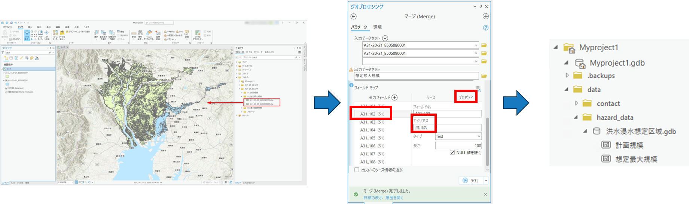

# データ準備マニュアル

# 1. 本書について

本書では、損害額シミュレータ（以下「本システム」という。）を動かすために必要なデータの準備手順について記載しています。本システムの構成や仕様の詳細については[技術検証レポート](https://XXXXX)も参考にしてください。

# 2. データ準備手順

本システムで必要となるデータの準備は以下の手順で行います。

## 2-1. 3D都市モデルの変換
CityGML形式の3D都市モデルをファイルジオデータベース形式（FGDB形式と呼ぶ）に変換するための手順です。

- [3D都市モデル「CityGML(v2)」](https://www.geospatial.jp/ckan/dataset/plateau)をダウンロードください。v1では動きませんのでご注意ください。

- CityGML形式からFGDB形式への変換はESRI社が公開している「[3D-CityModel-ConversionTools-for-ArcGIS-v2](https://github.com/EsriJapan/3D-CityModel-ConversionTools-for-ArcGIS-v2)」の手順に沿って変換ください。ただし、この変換を行うにはArcGIS Proのエクステンション（有料オプション）である「ArcGIS 3D Analyst」が必要となりますのでご注意ください。

## 2-2. 洪水浸水想定区域データの変換
シェープ形式の「国土数値情報 洪水浸水想定区域データ」をFGDB形式に変換するための手順です。

- シェープ形式の[洪水浸水想定区域データ](https://nlftp.mlit.go.jp/ksj/gml/datalist/KsjTmplt-A31a-v4_0.html)をダウンロードください。

- ArcGIS Proを起動し、プロジェクトファイルを作成します。（プロジェクトファイル名に指定はありません。手順書上は「Myproject1」としています。）

- カタログウィンドウ上で「フォルダー接続の追加」を行い、先ほどDLしたシェープファイルをプロジェクトファイルに接続します。 

- 変換する計画規模のデータをマップにドラッグ&ドロップをして追加し、確認します。

- [解析] タブ → [ツール] → [ジオプロセシング] ウィンドウのツールの検索窓に「マージ（Merge)」と入力 → [マージ(Merge)] ツールを起動します。

- 入力データセットを指定、出力データセットで「C:\plateau\data\hazard_data\洪水浸水想定区域.gdb」に 「計画規模」の名称で設定、実行をクリックします。

- FGDB形式に変換されたことが確認できます。 

- 変換する想定最大規模のデータをマップにドラッグ&ドロップをして追加し、確認します。

- [解析] タブ → [ツール] → [ジオプロセシング] ウィンドウのツールの検索窓に「マージ（Merge)」と入力 → [マージ(Merge)] ツールを起動します。

- ジオプロセシングツールの「マージ（Merge)」ツールを使用し、入力データセットを指定、出力データセットで「C:\plateau\data\hazard_data\洪水浸水想定区域.gdb」に 「想定最大規模」の名称で設定、実行をクリックします。 

## 2-3. 契約フラグを付けるためのデータ準備
契約フラグを立てるためには、契約物件一覧の「緯度経度」を記載したCSVデータを、FGDBに変換します。

- 契約フラグを立てたい物件の「緯度経度」が書かれたCSVを準備する。1行目はタイトル行のため、データは登録しないようにご注意ください。タイトル名は任意です。 

- ArcGIS Pro を起動します。

- [解析] タブ → [ツール] → [ジオプロセシング] ウィンドウの検索窓にて「xy」と入力 → [XY テーブル →ポイント] ツールをクリック → 以下の設定を行い、[実行] をクリックします。 

## 2-4. 不動産IDを紐づけるためのデータ準備
建物に不動産IDを紐づけるためには、3D都市モデルの「uro:buildingID」と「不動産ID」の一覧を記載したCSVデータを準備します。

- C:\plateau\data\不動産IDに「lod_建物不動産ID.csv」のファイルを格納します。ファイル名は固定となります。

- ファイル内の1行目には「bldg_Building_gml_id」と「gen_建物不動産ID」の列名をご用意ください。この「bldg_Building_gml_id」には「uro:buildingID」を記載します。そこに紐づけたい不動産IDを「gen_不動産ID」に記載ください。ここに記載のない建物には不動産IDは紐づきません。 

## 2-5. 設定ファイルの更新
「C:\plateau\tools\tables」に以下の3つのファイルがあります。ダミーの値が設定されているので、適切に修正ください。いずれも「用途×構造種別」ごとに値を設定する必要があります。用途と構造種別の番号は、[製品仕様書](https://www.mlit.go.jp/plateau/file/libraries/doc/plateau_doc_0001_ver03.pdf)をご確認下さい。

- 評価額_建物単価.csv：1平米あたりの単価[円]を記載します。
- 浸水損傷率_建物.csv：浸水深あたりの損害率を記載します。
- 土砂損傷率_建物.csv：堆積深あたりの損害率を記載します。 

評価額のCSVイメージ 

損傷率のCSVイメージ 

