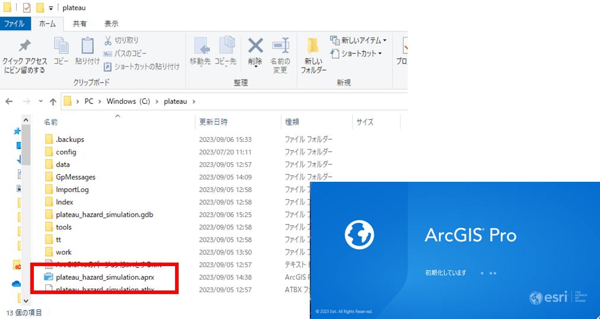
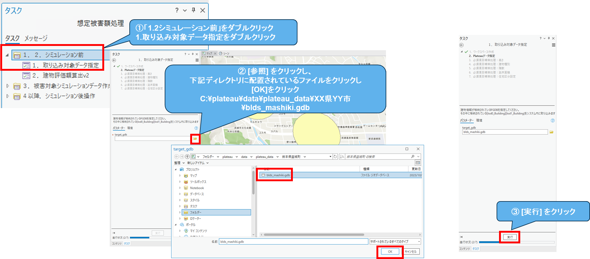
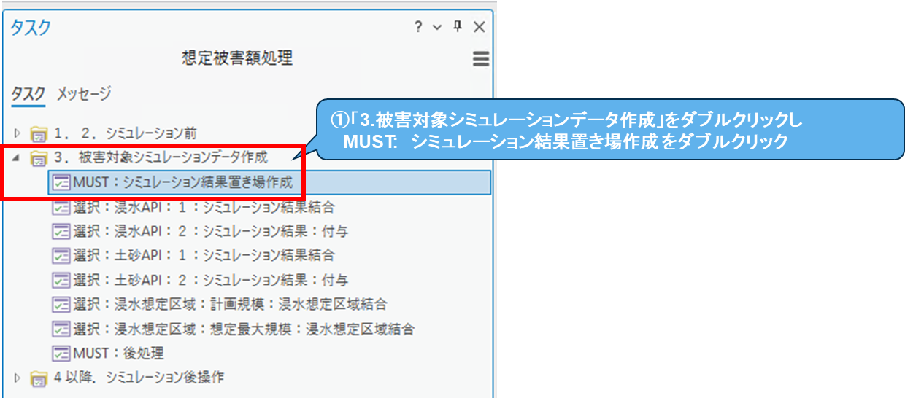
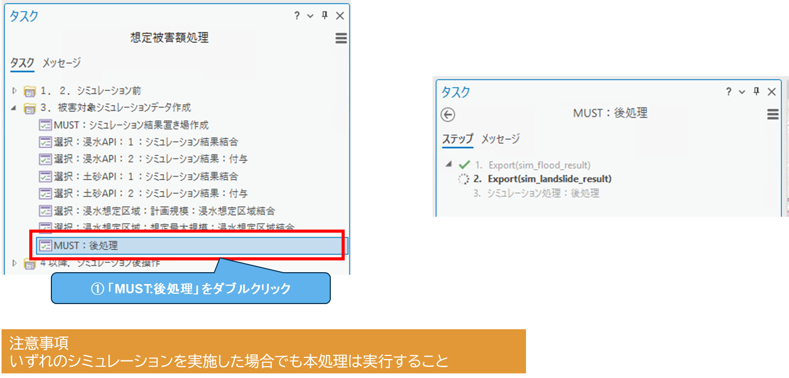
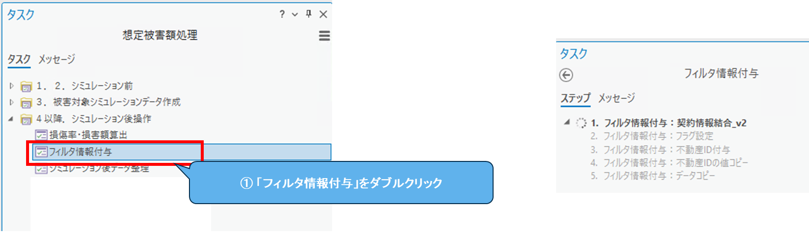
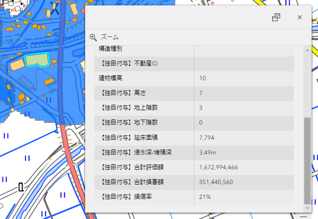

# 洪水想定区域：最大規模 操作マニュアル

# 1. 洪水想定区域：最大規模とは
国交省が公開している「国土数値情報　洪水浸水想定区域データ」を利用して、浸水シミュレーションされた後の被害エリアを選択して、そのエリアの損害額を調査する手順です。
この使い方を説明するページとなります。

# 2. 使い方

## 2-1. 起動
- 「plateau_hazard_simulation.aprx」をダブルクリックし、ArcGIS Pro を起動ください。※起動時に認証が求められた場合は、アカウントをお持ちと思いますので、そのID/PWでサインインください。
  

- タスクウィンドウを表示させます。
  

## 2-2. 「1.2. シミュレーション前」の実行

- シミュレーションを行いたい3D都市モデル（FGDB形式）を指定し、読み込みます。
  

- 読み込んだ3D都市モデル（FGDB形式）に対して評価額を算出します。
  

## 2-3. 「3. 被害対象シミュレーションデータ作成」の実行

- 事前処理として、被害シミュレーションデータの事前処理を行います。
  

- 想定最大規模の浸水想定区域から浸水エリアを指定します。この作業が終わりましたら[2-3-6. 事後処理]の手順を実行ください。
  
  

- 指定終わりましたら、シミュレーション結果と建物情報を結合します。
  

## 2-4. 「4. シミュレーション後操作」の実行

- 損傷率と損害額を算出します。
  

- 建物情報に契約情報と建物不動産IDを紐づけます。
  

- ポップアップなどで使用する論理名(エイリアス)を設定します。
  

## 2-5. シミュレーション結果を確認する
これで全ての処理が終わりました。建物1つ1つをクリックすると、詳細な情報を確認できます。
  

